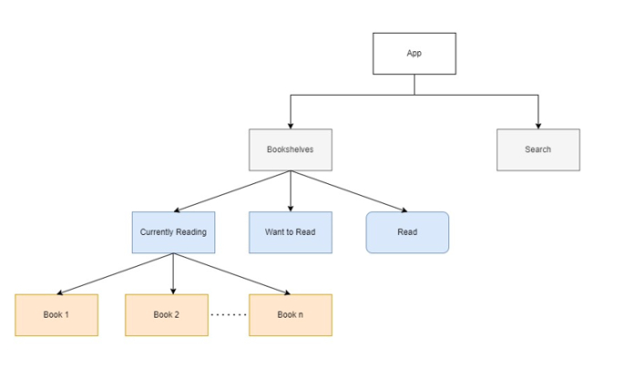
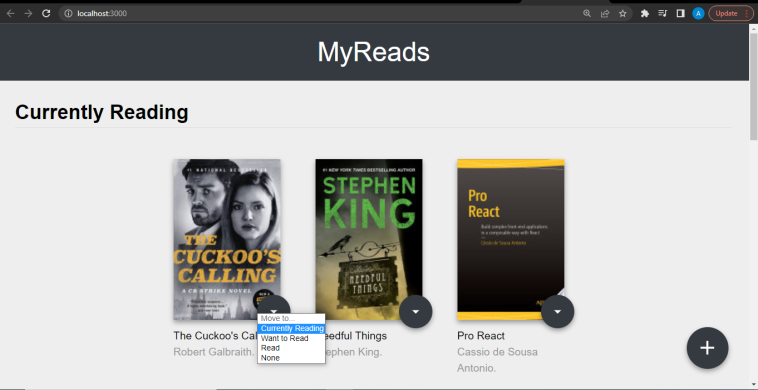
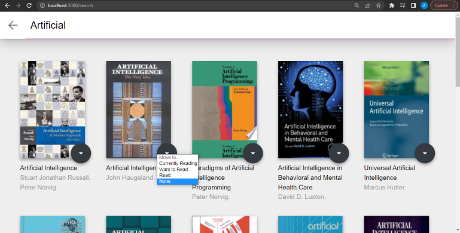

# Udacity NanoDegree React MyReads App

## Overview
This Project is a part of a udacity nanodegree. Basically, a book management system for organizing your reads.
The API is provided by udacity and is built using reactjs.

## About the application
Have you ever been baffled by keeping up with your reading list? which books you read?
whether you liked the books or not? which books are you going to read next? FRET NO MORE
this application will help you to keep up with your reading as it provides you with all that you need to keep your books organized.
### Functionality
the main page shows 3 shelves
- Currently Reading Books
- Want to Read Books
- Read Books
not only that you could also add more books using the search page.
## How to run the application
```
>git clone https://github.com/Amr-Magdy95/udacitynd_react_myreads
>cd udacitynd_react_myreads
>npm i
> npm start
//it will most-likely run on its own,if it doesn't copy the url provided in the next line
http://localhost:3000
```

## Screenshots
* An illustration of the hierarchy 

* Screenshots of the pages available




## HELPFUL RESOURCES
- https://stackoverflow.com/questions/52259128/react-submit-form-on-select-change-event 